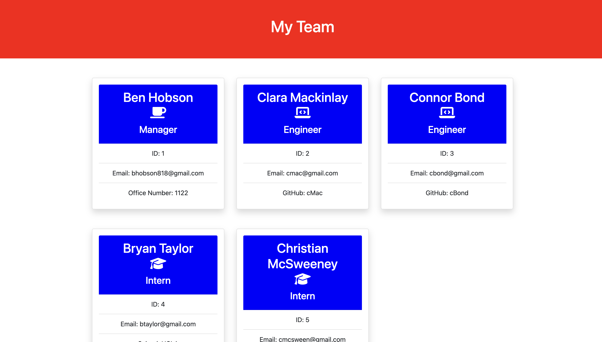

# teamGenerator

## Description

This project allows a user to display the members of their team and some info about them by responding to the prompts they recieve through Inquirer in the terminal. The user starts the process by entering "npm start" in the command line. The first thing they are asked is to fill out the manager info. After this step they are able to continue by adding employees. Their options are "Engineer", "Intern", or "None". Selecting "None" will end the function and stop the server. After the user is done, and has selected "None", HTML is generated using the users inputs, and indevidual employee cards are generated onto the main page. Working on this project really helped me understand how to write tests using Jest for your code, how use constructors and classes, exporting modules, and ultimatly just better understand object oriented programming.

## Tech Used

Javascript, Node, Inquirer, Jest, Bootstrap, Font Awesome

## Link to video

https://drive.google.com/file/d/1YmLsUxO31DD-zQ_ihk0Xjkh_2GwpEEHf/view

## Screenshots

